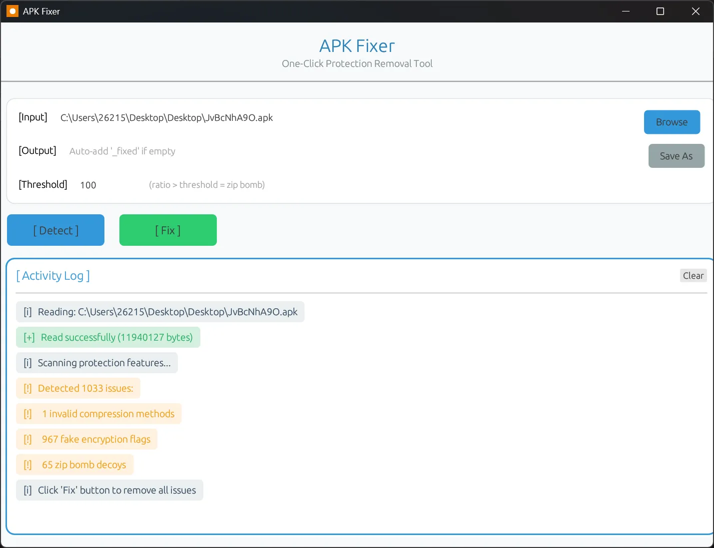
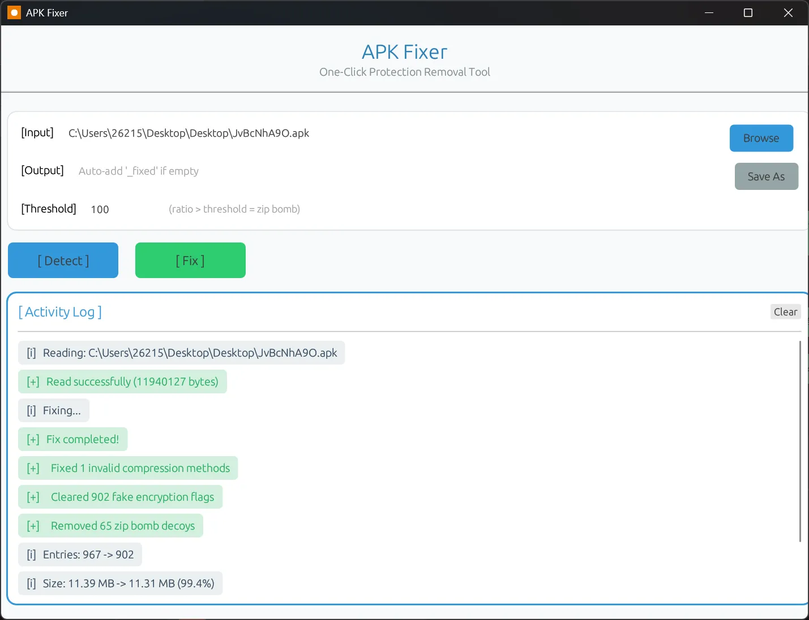

# APK Fixer

一键检测并修复 APK 中的反分析保护特征

## 功能特性

### 检测并修复三类保护特征

1. **非标准压缩方法** (Compression Method)
   - 检测所有不符合 ZIP 标准的压缩方法值
   - 自动修正为标准的 Deflate (0x0008)
   - 同时修复 Central Directory Header 和 Local File Header

2. **伪造加密标志** (Encryption Flag)
   - 检测 flags 字段 bit 0（加密标志）
   - 实际数据未加密，仅用于欺骗分析工具
   - 清除伪造标志，恢复正常访问

3. **Zip Bomb 诱饵条目** (Zip Bomb Decoys)
   - 检测压缩比异常的诱饵条目（默认 >100x）
   - 从 Central Directory 中完全移除
   - 重建 EOCD，更新条目计数和大小

### 通用性

- ✅ 基于标准 ZIP 格式规范
- ✅ 适用于所有使用类似保护的 ZIP/APK 文件
- ✅ 不依赖特定 APK 内容或结构
- ✅ 纯元数据操作，不解析 DEX/资源

## 编译

### 前置要求

- Rust 工具链：https://rustup.rs/
- Windows 平台（用于图标嵌入）

### 编译命令

```bash
# 进入项目目录
cd C:\Users\xxxx\Desktop\apk-fixer

# 编译 GUI 版本（推荐）
cargo build --release --bin apk-fixer-gui

# 编译 CLI 版本
cargo build --release --bin apk-fixer

# 输出位置
# GUI: target\release\apk-fixer-gui.exe
# CLI: target\release\apk-fixer.exe
```

### 清理编译产物

```bash
cargo clean
```

## 使用方法

### GUI 版本

1. 双击 `apk-fixer-gui.exe` 打开程序
2. 点击 "Browse" 选择要检测的 APK 文件
3. 点击 "[ Detect ]" 检测保护特征，或直接点击 "[ Fix ]" 一键修复
4. 修复后的文件会自动添加 `_fixed` 后缀





### CLI 版本

```bash
# 检测模式（只扫描，不修改）
apk-fixer detect <file.apk>

# 修复模式（一键修复）
apk-fixer fix <file.apk>

# 指定输出路径
apk-fixer fix <file.apk> -o <output.apk>

# 自定义 Zip Bomb 阈值
apk-fixer fix <file.apk> -r 150

# 查看帮助
apk-fixer --help
```

## 技术细节

### 修改的 ZIP 结构偏移

#### 1. Central Directory Header (CDH)
- **偏移 +8** (2 字节): 通用标志位 → 清除 bit 0
- **偏移 +10** (2 字节): 压缩方法 → 修正为 0x0008

#### 2. Local File Header (LFH)
- **偏移 +6** (2 字节): 通用标志位 → 清除 bit 0
- **偏移 +8** (2 字节): 压缩方法 → 修正为 0x0008

#### 3. End of Central Directory (EOCD)
- **偏移 +10** (2 字节): 总条目数 → 减少计数
- **偏移 +12** (4 字节): CD 大小 → 重新计算
- **偏移 +16** (4 字节): CD 偏移 → 重新定位

### 支持的标准压缩方法

| 值 | 名称 | APK 常见 |
|----|------|---------|
| 0 | Store (无压缩) | ✓ |
| 8 | Deflate | ✓ |
| 9 | Deflate64 | |
| 12 | Bzip2 | |
| 14 | LZMA | |
| 93 | Zstandard | |
| 95 | XZ | |

**所有不在上述列表的值都视为非标准方法**

## 常见问题

### Q: 修复后的 APK 能直接安装吗？
**A:** 需要重新签名。修复后使用 `apksigner` 或 `jarsigner` 重新签名：
```bash
apksigner sign --ks my-key.jks fixed.apk
```

### Q: 工具会修改 APK 的功能代码吗？
**A:** 不会。工具只修改 ZIP 元数据（压缩方法、标志位、条目列表），不解析或修改 DEX、资源等内容。

### Q: 为什么选择 Deflate (8) 作为修复目标？
**A:** Deflate 是 ZIP 规范中最广泛支持的压缩方法，所有解压工具都能正确处理。

### Q: 可以用于普通 ZIP 文件吗？
**A:** 可以！工具基于标准 ZIP 格式，适用于任何 ZIP 文件。

### Q: 压缩比阈值怎么设置？
**A:** 默认 100x 适用于大多数场景。正常文本压缩比通常 <10x，超过 100x 可疑。

## 项目结构

```
apk-fixer/
├── build.rs            # 构建脚本（嵌入图标）
├── Cargo.toml          # 项目配置
├── 1.ico               # 应用程序图标
├── icon.png            # 窗口图标
├── README.md           # 本文档
└── src/
    ├── main.rs         # CLI 入口
    ├── gui.rs          # GUI 入口
    ├── compression.rs  # 压缩方法枚举和验证
    ├── zip_structures.rs # ZIP 结构体定义和解析
    ├── detector.rs     # 问题检测逻辑
    └── fixer.rs        # 一键修复逻辑
```

## 许可证

MIT License

## 安全研究声明

本工具仅用于合法的安全研究和教育目的。使用者需确保：
- 对目标 APK 拥有合法授权
- 遵守当地法律法规
- 不用于恶意目的

